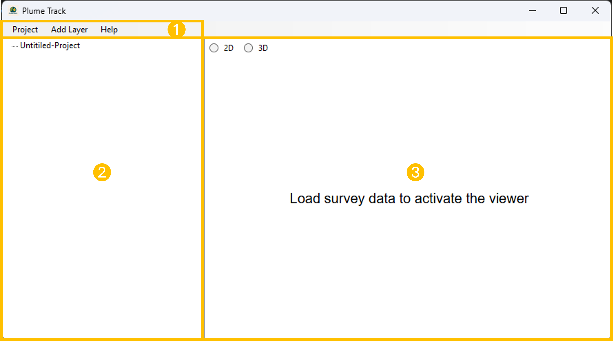
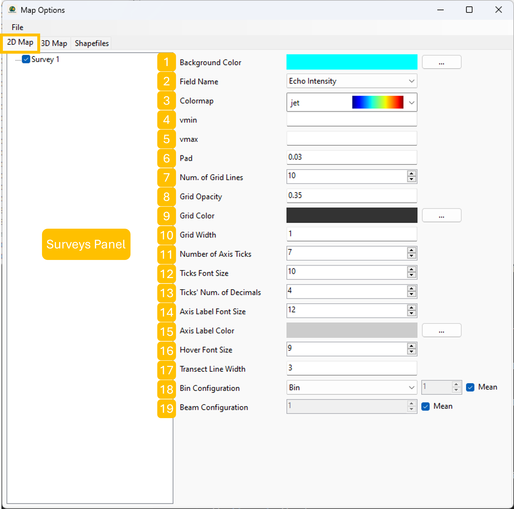
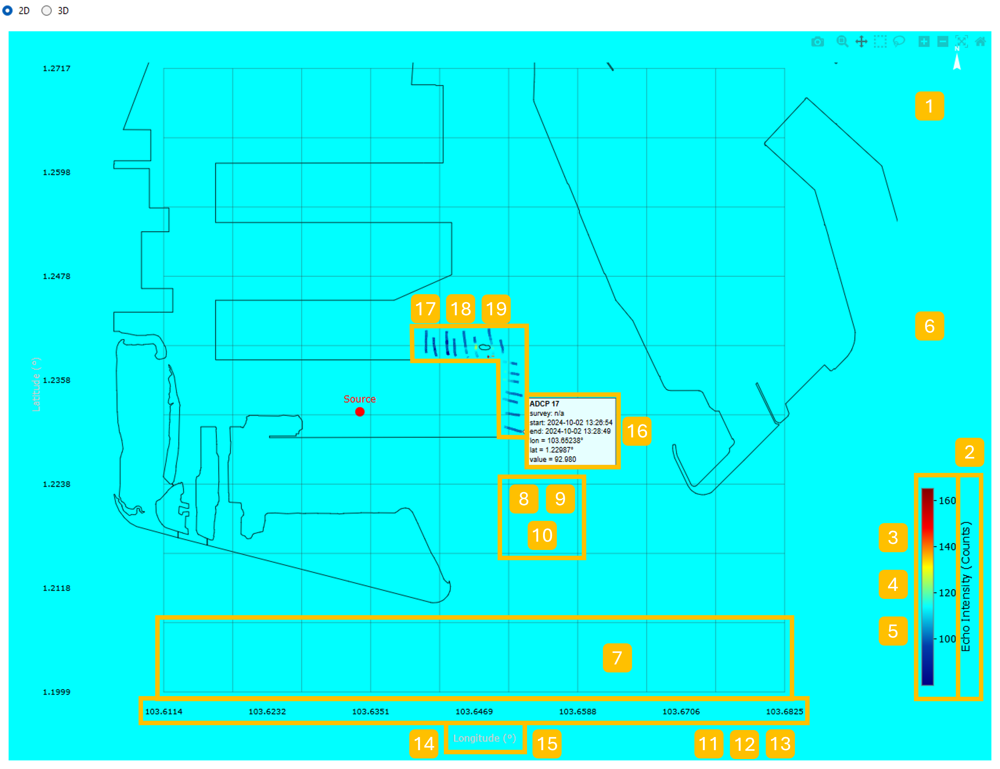

The main window of Plume Track consists of three main sections ():

1. **Main Menu**: The main menu includes three dropdown menus: `Project`, `Add Layer`, and `Help`. The `Project` menu contains options to create a new project, open an existing project, save the current project, save the current project as a new file, set [project properties](#project-properties), set the [map options](#map-options), and exit the application. The `Add Layer` menu allows users to add different types of layers to the project (see [Project Components](#project-components)). The `Help` menu provides access to the user guide and information about the application. 

2. **Layer Control Panel**: The layer control panel is located on the left side of the main window. It displays a list of all the layers in the current project. Each layer can be modified by double-clicking on it, or by right-clicking to access a context menu with options to open, delete, or plot (just for some layers) the layer.

3. **Map View**: The map view occupies the main area of the window and displays either 2D or 3D visualizations of the vessel mounted ADCPs. The map properties can be adjusted through the [`Project\Map Options`](#map-options) menu in the main menu.

Before starting to work with Plume Track, it is important to understand different components of a project. Section below provides an overview of the various components available in a Plume Track project.

## Project Components

There are various components in each Plume Track project which can be categorized in three main groups:

1. **Surveys**: A `survey` component contains all the information related to the observational data collected during a specific survey. Survey can store information about `Vessel Mounted ADCP`, `OBS Vertical Profile`, and `Water Sample`.

2. **Simulations**: There are two types of simulation components in Plume Track: `HD Model` and `MT Model`.

3. **SSC Models**: `SSC Model`s are the components used to convert Absolute Backscatter data collected by vessel mounted ADCPs and NTU data from OBS vertical profilers into Suspended Sediment Concentration (SSC) values. Each SSC Model contains a set of parameters that define the relationship between the measured values and the SSC.

Each of these components are defined as a layer in Plume Track and can be added, removed, or modified independently. This modular approach allows users to manage and analyze different aspects of their projects effectively.

## Project Properties

In Plume Track, it has been tried to keep the project properties as simple as possible. The only global property that needs to be defined for each project is the `EPSG Code`. The `EPSG Code` defines the coordinate reference system (CRS) used for all spatial data in the project. It is crucial to set the correct `EPSG Code` to ensure that all layers align properly on the map view. The default value is set to `4326`, which corresponds to the WGS 84 coordinate system (latitude and longitude).

There is also an optional `Project Description` field where users can provide additional information about the project. This description can be useful for documentation purposes and to provide context for other users who may work on the project in the future.

## Map Options

Map options section consists of three tabs: `2D Map`, `3D Map`, and `Shapefiles`. 

### 2D Map

In this tab, users can customize the appearance of the 2D map view. There are two main sections in this tab: `Surveys Panel` and map appearance settings (). `Surveys Panel` includes the list of all the surveys in the project with checkboxes to toggle their visibility on the map view. The map appearance settings include the following options:

1. **Background Color**: Users can select the background color of the 2D map view using the button (`...`) next to the color display.

2. **Field Name**: This dropdown menu allows users to select the desired parameter from the vessel mounted ADCP transects that will be displayed on the 2D map.

3. **Colormap**: Users should select a colormap from the dropdown menu to define how the selected field of the transects are represented visually on the map.

4. **vmin**: This input field allows users to set the minimum value for the color scale. Values below this threshold will be displayed using the lowest color in the selected colormap.

5. **vmax**: This input field allows users to set the maximum value for the color scale. Values above this threshold will be displayed using the highest color in the selected colormap.

6. **Pad**: The pad value defines the buffer distance around the whole map view extent. This buffer ensures that all elements are fully visible within the map view.

7. **Num. of Grid Lines**: This input field allows users to specify the number of grid lines to be displayed on the 2D map view for better spatial reference.

8. **Grid Opacity**: The opacity value defines the transparency level of the grid lines on the 2D map view. A value of `0` means fully transparent, while a value of `1` means fully opaque.

9. **Grid Color**: Users can select the color of the grid lines using the button (`...`) next to the color display.

10. **Grid Width**: This input field allows users to set the width of the grid lines on the 2D map view.

11. **Number of Axis Ticks**: This input field allows users to specify the number of ticks to be displayed on each axis of the 2D map view.

12. **Ticks Font Size**: This input field allows users to set the font size of the axis ticks on the 2D map view.

13. **Ticks' Num. of Decimals**: This input field allows users to define the number of decimal places to be displayed for the axis ticks on the 2D map view.

14. **Axis Label Font Size**: This input field allows users to set the font size of the axis labels on the 2D map view.

15. **Axis Label Color**: Users can select the color of the axis labels using the button (`...`) next to the color display.

16. **Hover Font Size**: This input field allows users to set the font size of the hover text that appears when hovering over transects on the 2D map view.

17. **Transect Line Width**: This input field allows users to set the width of the lines representing the vessel mounted ADCP transects on the 2D map view.

18. **Bin Configuration**: This dropdown menu allows users to select what data to be displayed at the transects. There are three options available:
    - `Bin`: Displays data either at a specific bin defined by the user or as an average over all bins.
    - `Depth`: Displays data at a specific depth defined by the user.
    - `HAB`: Displays data at a specific height above the bed defined by the user.

19. **Beam Configuration**: This option allows users to select which beam data to be displayed on the transects. It can be either a single beam or an average over all beams.

### 3D Map

### Shapefiles

## Adding Layers to a Project

### Surveys

#### Vessel Mounted ADCPs

#### OBS Vertical Profiles

#### Water Samples

### MIKE Simulation Results

#### HD Models

#### MT Models

### SSC Models

#### NTU to SSC Model

#### Absolute Backscatter to SSC (via OBS) Model

#### Absolute Backscatter to SSC (via Water Sample) Model

## Plotting Features

### Vessel Mounted ADCP Plots

#### Platform Orientation

#### Four Beam Flood Plot

#### Single Beam Flood Plot

#### Velocity Flood Plot

#### Transect Velocity Plot

#### Beam Geometry Animation

#### Transect Animation

### SSC Model Calibration Plots

#### Regression Plot

#### Transect Plot

### Project-Level Plots

#### HD Comparison Plot

#### MT Comparison Plot

#### HD/MT Comparison Plot

#### HD/MT Animation